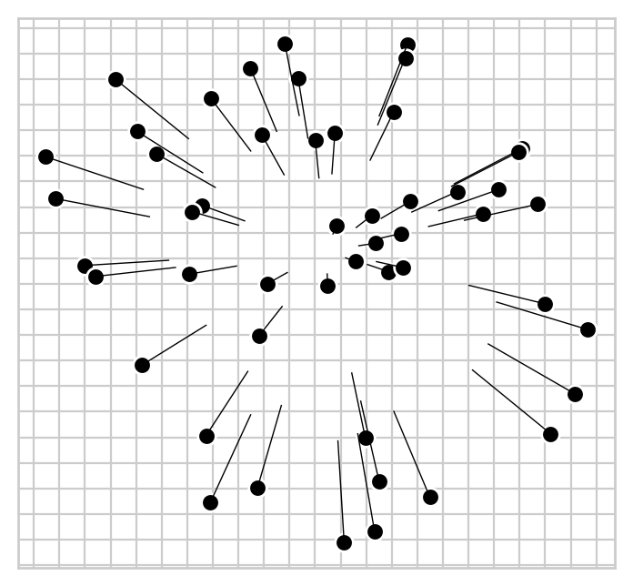

#########
``pymds``
#########

Metric multidimensional scaling in python.

************
Installation
************

Use `pip`_::

    pip install pymds

*********
Reference
*********

.. toctree::
   :maxdepth: 3

   mds

**********
Background
**********

Multidimensional scaling aims to embed samples as points in `n`-dimensional space, where the distances between points represent distances between samples in data.

In this example, edges of a triangle are specified by setting the distances between three vertices `a`, `b` and `c`. These data can be represented perfectly in 2-dimensions. 

.. literalinclude:: distance-matrix-example.py

In data where distances between samples cannot be represented perfectly in the number of dimensions used, residual error will exist among the distances between samples in the space and the distances in the data.

Error in MDS is also known as `stress`.

*****
Usage
*****

The following example demonstrates some simple pymds features.

.. literalinclude:: orient-plot-example.py

.. _pip: https://pypi.python.org/pypi/pip
